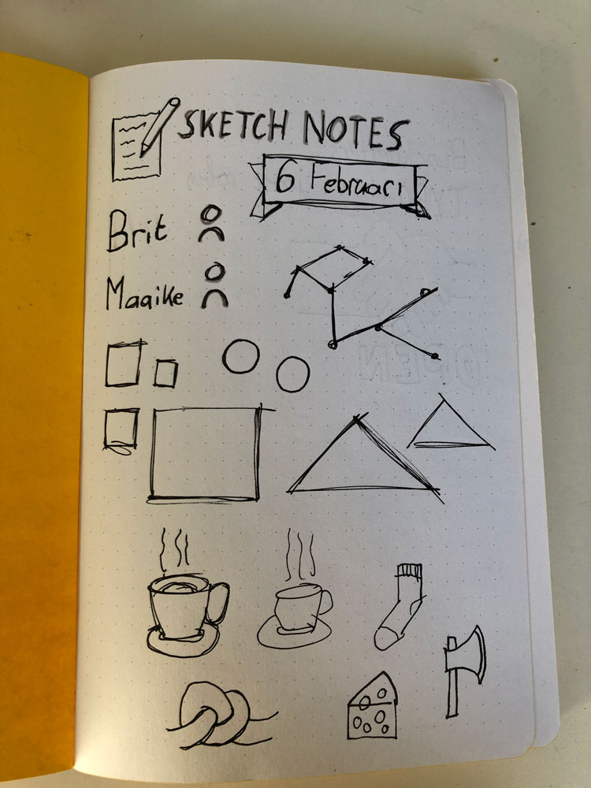
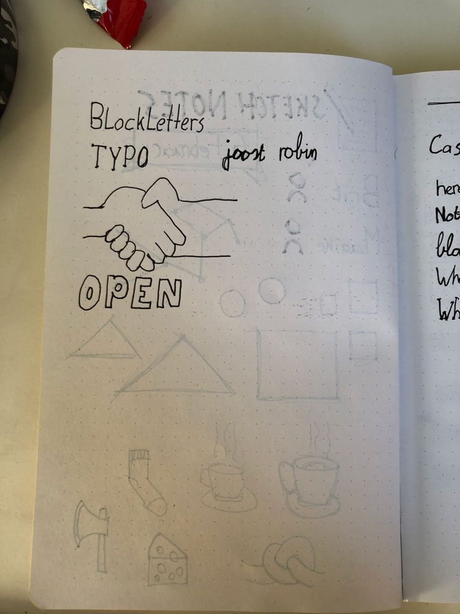
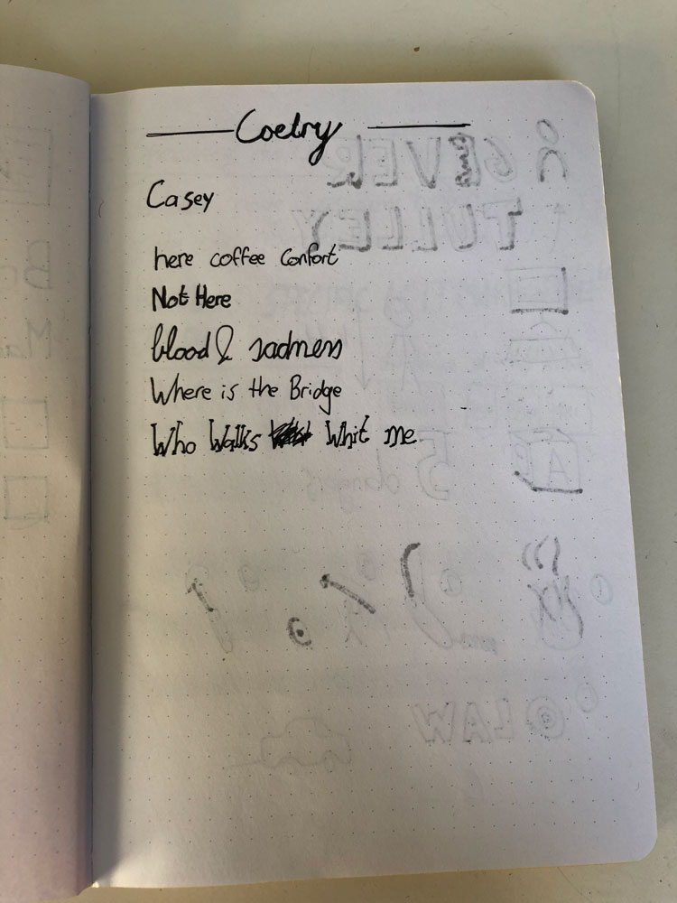
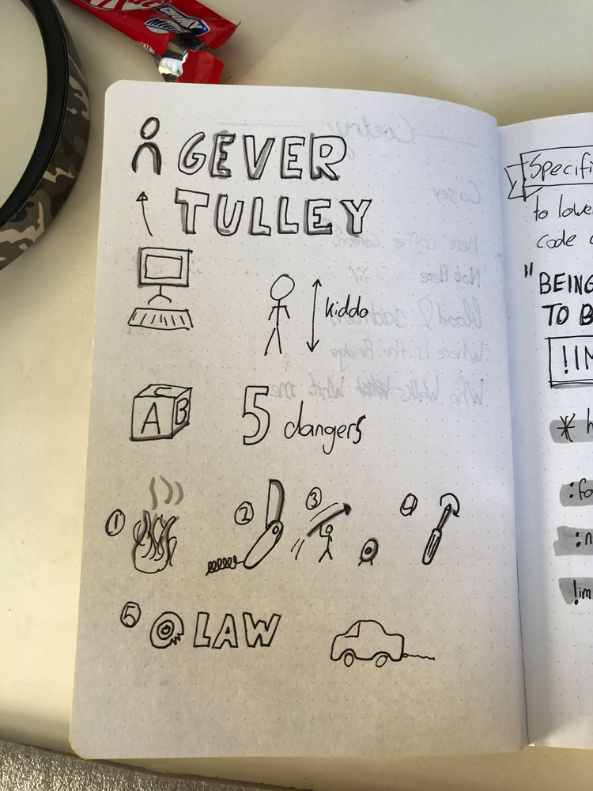
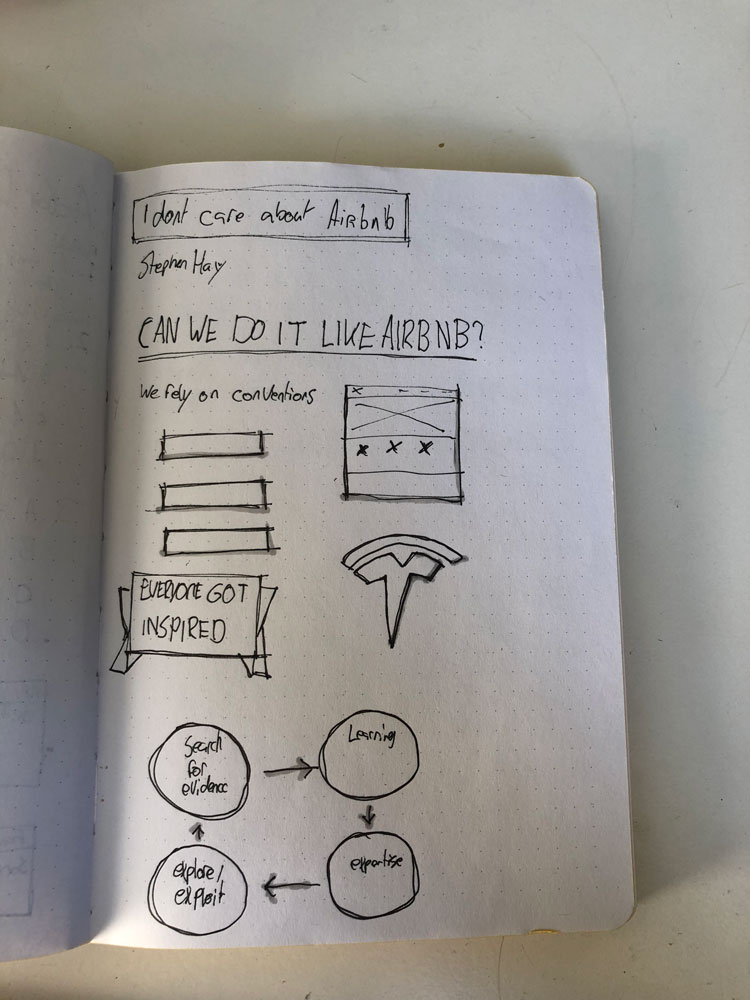
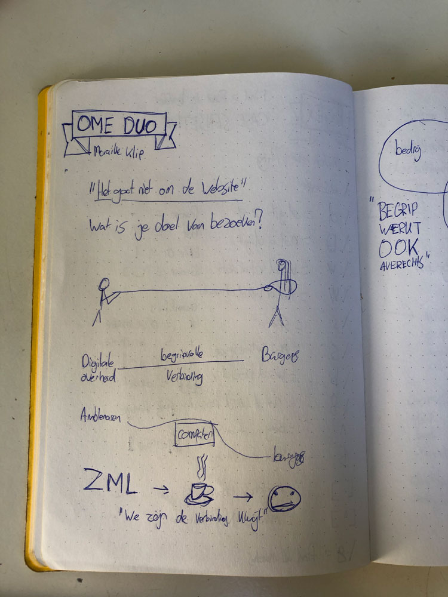
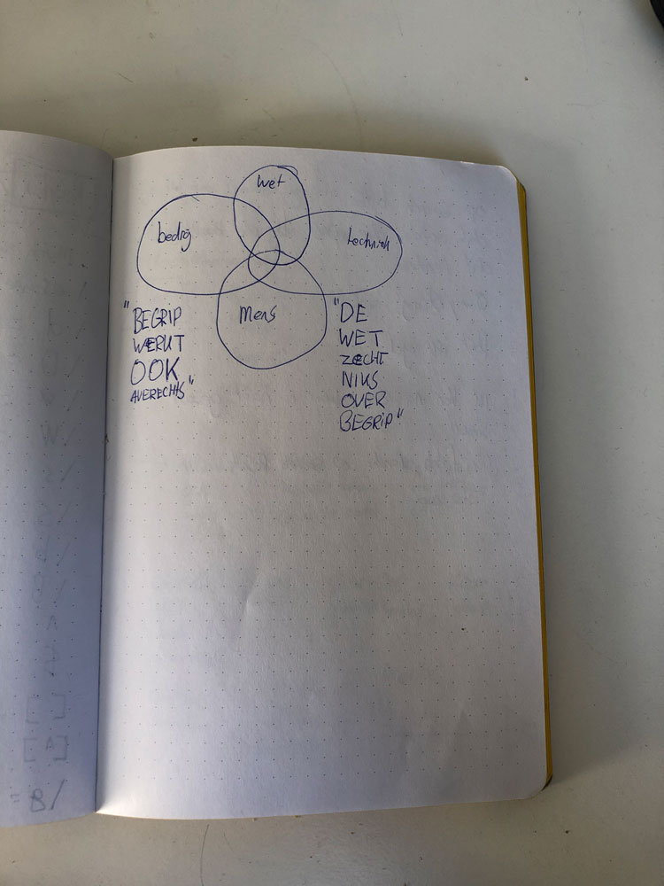
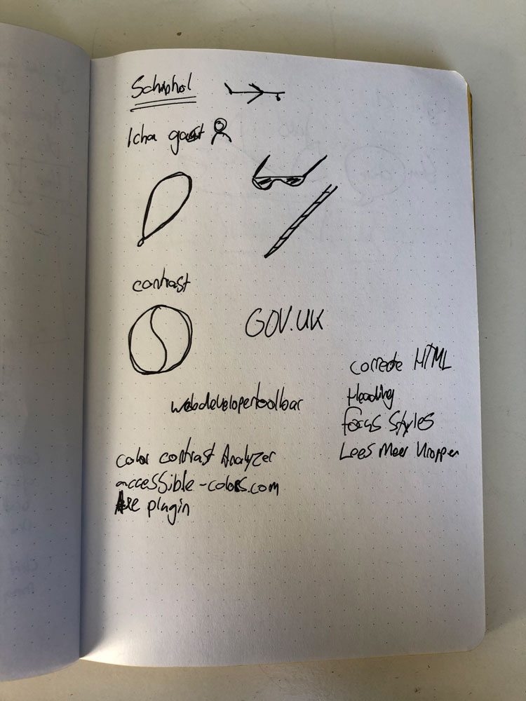
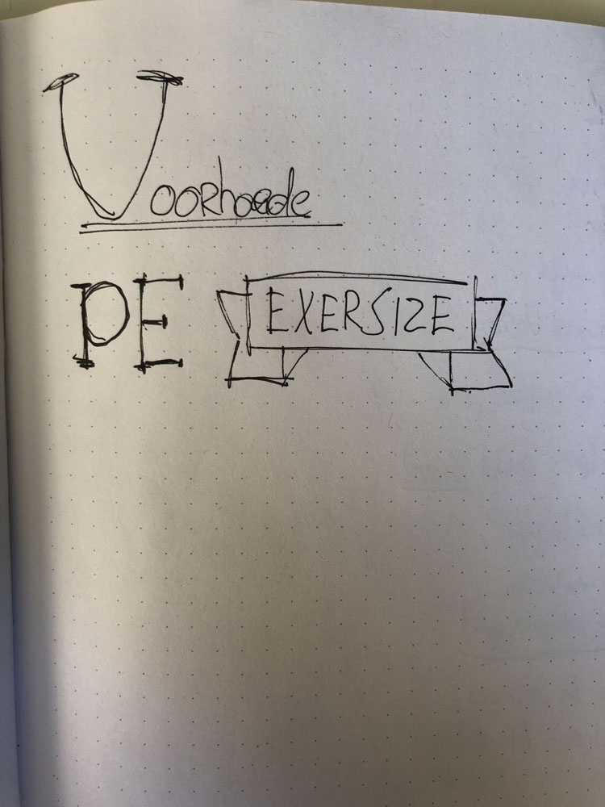

# Weekly Nerd @cmda-minor-web · 2018-2019

## Weekly Geeks

### Weekly Geek 1 - Maaike van Cruchten

Schetsen

Korte samenvatting:

Deze Weekly Geek ging voornamelijk over het nut van sketchnotes maken en hoe leuk het kan zijn. We hebben hier vaker mee geëxperimenteerd tijdens Ontwerpgeschiedenis.

### Weekly Geek 2 - Stephen Hay

Schetsen

Korte samenvatting:

Stephen Hay vertelde over zijn ergernis van klanten die vragen om net zoiets als Airbnb te ontwerpen. De identiteit van je bedrijf raakt hierdoor verloren en je verdwijnt in de massa die ook het Airbnb ontwerp hanteren.

### Weekly Geek 3 - Matise

Korte samenvatting:

Twee werknemers van Matise kwamen laten zien hoe snel iets opgebouwd kan worden zodra je hier makkelijke herbruikbare code voor maakt. Ook werd er verteld waar ze zelf moeite mee hadden tijdens de Minor. Doordat de presentatie op hoog tempo ging, heb ik helaas geen aantekeningen kunnen maken.

### Weekly Geek 4 - Maike Klip

Schetsen

Korte samenvatting:

De presentatie ging over de band tussen Duo en die van de klant. In een filmpje werd op straat gevraagd hoe goed jij verbonden wilt zijn met Duo, dit werd ook op het podium getest. Volgens Maaike zijn we de verbinding tussen elkaar kwijt. Ook werd er een stukje besproken over Zondag met Lubach

### Weekly Geek 5 - Ischa Gast

Schetsen

Korte samenvatting:

Op schiphol kregen we 2 sprekers, de eerste vertelde over zijn werkzaamheden voor schiphol en wat er belangrijk is qua accessibility. Vervolgens kwam een blind persoon laten zien hoe hij met zijn computer omgaat, en waar de ergernissen kunnen zijn. Een voorbeeld werd gegeven met zijn zorgverzekeraar.

### Weekly Geek 6 - Voorhoede

Schetsen

Korte samenvatting:

Bij de voorhoede hebben we een uitleg gekregen over hoe er gedacht kan worden op gebied van oplossingen. Vervolgens zijn we in groepen opgedeeld om een probleem aan te pakken. Het doel hiervan was dat er voor elke situatie een passende oplossing was. Iemand zonder javascript moet ook de pagina kunnen gebruiken.

### ~~Weekly Geek 7 - Daan Rongen~~

Deze Weekly geek heb ik helaas niet bij kunnen wonen.

## Weekly Mingle

### Elastique

Elastique is een bedrijf van ongeveer 50 personen. Ze doen alles binnen huis en werken voor redelijk grote bedrijven. Ze bevinden zich in Hilversum, ongeveer 5 minuutjes van het station. Er zijn meerdere teams aanwezig, voor web maar ook voor mobiel. Ik vond het een interessant bedrijf en zou er ook wel stage willen lopen.

### Valtech

Valtech zit in Amsterdam en de meeting werd gegeven in het engels. Het kwam op mij over alsof ze zich beter wilde voordoen dan dat ze zijn. Er werd veel opgeschept met de grote merken waar ze voor werkte en de landen waarin ze gevestigd zaten. Over het algemeen vond ik het geen leuke meeting, en zou hier niet direct solliciteren.

### Mirabeau

Bij Mirabeau hebben we een gesprek gevoerd met drie verschillende sectoren. De designer vertelde dat hij pas kort bij Mirabeau werkte en wat zijn ervaring was tot nu toe. Één van de andere heette Tim, en hij vertelde vol passie hoe hij zijn studentenhuis volledig had geautomatiseerd. Ik vond het erg interessant om hier met hem over te praten en ook na afloop van de mingle hebben we hier nog over door gekletst. Hij had me wat adviezen gegeven van wat ik zou kunnen doen in mijn kamer, want ik was er ook in geïnteresseerd. Over het algemeen heb ik een positief gevoel van het bedrijf.

### Q42

Q42 heeft een onwijs mooie kantoor. Tijdens het gesprek hebben we het gehad over een aantal projecten, en raadde ze ons aan om met Firebase te werken omdat hier gemakkelijk gewerkt kan worden met real-time data. Verder kregen we een rondleiding en was er een grote glijbaan en een schommel in het best kleine pand.

### Matise

Matise kende we qua naam al van een van de Weekly Nerds. De locatie is aan de rand van Artis, en de olifanten zijn te zien vanaf het raam. Na de korte intro over het bedrijf werden we aan het werk gezet en moesten we een oplossing bedenken voor een bestaande klant van Matise. Ondanks ik het niet erg vond om gezamenlijk een idee te bedenken, vond ik het toch wat vreemd om ideeën te genereren die eventueel gebruikt konden worden. Hierdoor vond ik het bedrijf toch wat minder leuk.

### Icatt

Icatt zit op een mooie locatie in het centrum van Amsterdam. Het gesprek was met 4 andere personen. Een hiervan was een oud student die ook haar stage had afgerond bij Icatt. Verder vertelde de leidinggevende over hoe het bedrijf was opgericht. De twee andere jongens vertelde over hun werkzaamheden binnen het bedrijf. Als afsluiten kregen we de taak om met behulp van een formule jezelf te presenteren. Ik vond dit erg goed bedacht en dit helpt je goed naar jezelf te kijken en dat gaf Icatt ook een goed beeld van wie jij eigenlijk bent.

### Lifely

Lifely zit in Amsterdam en is een klein bedrijfje qua personen. Tijdens de Mingle hebben we een snelcursus gekregen over React, Typescript en graphQl. Alles werd live gecodeerd en dit inspireerde mij enorm. Het tempo waarin iets gemaakt werd en de kennis die hij hier over had heeft veel indruk op mij gemaakt. Een van mijn leerdoelen is om React te leren samen met Typescript, en dit kwam mij persoonlijk erg gunstig uit. Ik vond het bedrijf erg tof en zou er ook stage willen lopen.

### Dept

Dept bevond zich in een prachtig pand, waar we door de receptioniste werden ontvangen. Het gesprek werd gevoerd door 2 oud studenten, en die vertelde het proces van hoe ze hier terecht waren gekomen. Vervolgens werd er net zoals bij Valtech veel opgeschept over welke toffe dingen ze allemaal doen. De barbecues die ze hebben, de feesten die gevierd worden en het gezamenlijke wintersport met het bedrijf. Tijdens de rondleiding voelde ik me erg bekeken en voelde ik me niet op mijn gemak. Dit heeft mijn oordeel over het bedrijf wel beïnvloed.
